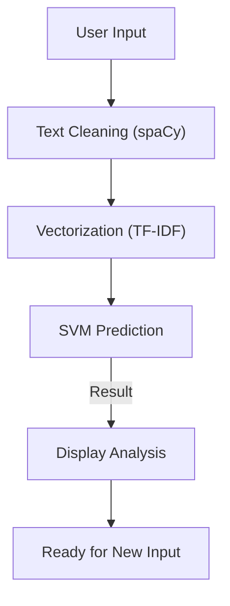

# Technical Specification: Depression Detection Using Tweets

## Architectural Overview

**Depression Detection System** is a Machine Learning application designed to analyze text data from tweets to predict depressive sentiment. The application utilizes a Support Vector Machine (SVM) model combined with Natural Language Processing (NLP) techniques to provide real-time classification through a modern web interface.

### Analysis Logic Flow

---

## Functional Components

### 1. Core Analysis Logic
-   **Model Architecture**: Linear Support Vector Machine (SVM) optimized for high-dimensional text classification.
-   **Preprocessing Pipeline**: Tokenization, lemmatization, and stop-word removal powered by the `en_core_web_lg` spaCy model.
-   **Feature Extraction**: TF-IDF vectorization to convert cleaned text into numerical features for model inference.

### 2. Web Application Layer
-   **Framework**: Flask-based micro-services architecture for handling HTTP requests and model serving.
-   **Static Assets**: Localized sound effects, iconography (SVG), and CSS animations to ensure reliable offline performance.
-   **Security**: Client-side protections including disabled right-click context menus and text selection to preserve interface integrity.

### 3. Deployment Pipeline
-   **Standalone Execution**: Designed for local deployment using standard Python environments, managed via a comprehensive `requirements.txt`.
-   **Asset Management**: Centralized `assets/` directory containing the serialized model, vectorizer, and linguistic datasets.

---

## Technical Prerequisites

-   **Runtime**: Python 3.9+ with `pip` package manager.
-   **Linguistic Data**: Pre-downloaded `en_core_web_lg` model for spaCy processing.
-   **Resources**: Moderate RAM (approx. 2GB) for loading the large NLP model into memory.

---

*Technical Specification | Python | Version 1.0*
